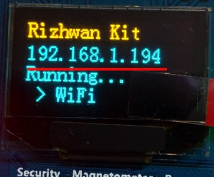
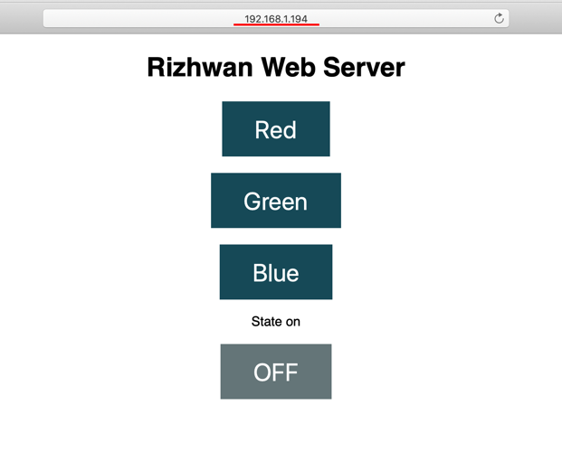
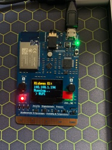
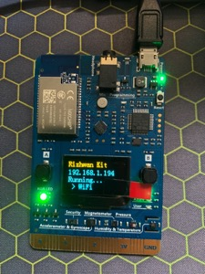
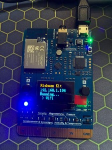

# What you need
A MXChip IoT DevKit board with a Micro-USB cable.  
Knowledge of using Ardunio & Visual Studio Code IDE

# Setup Environment
Please click the link below to set up your dnvironment  
https://microsoft.github.io/azure-iot-developer-kit/docs/get-started/

# Get Started
1. Connect the board to your PC / MAC
2. Verify & Upload
3. OLED Screen should display the IP address  

4. Type the IP address on the web browser
  

# Control
On your web browser you should see, 
1) Red, Green and Blue button.  
2) Turn On/Off button  

^Click the following button to control RGB LED

# Add different LED colour
You can set any colour by using RGB Color Codes.

Red: 
rgbLed.setColor(255, 0, 0);

  

Green:
rgbLed.setColor(0, 255, 0);

 

Blue:
rgbLed.setColor(0, 0, 255);

 

For more colour, please visit
https://www.rapidtables.com/web/color/RGB_Color.html

# Add button
Line 143 onward
```
client.println("<p><a href=\"/orange\"><button class=\"button\">orange</button></a></p>");
```

# Add navigation
Line 125 onward
```
else if (header.indexOf("GET /orange") >= 0)
{
 rgbLed.setColor(255, 128, 0);
}
```